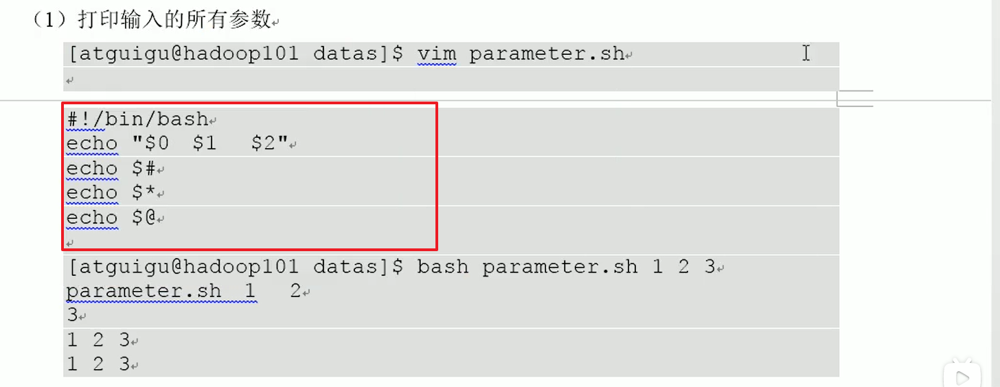
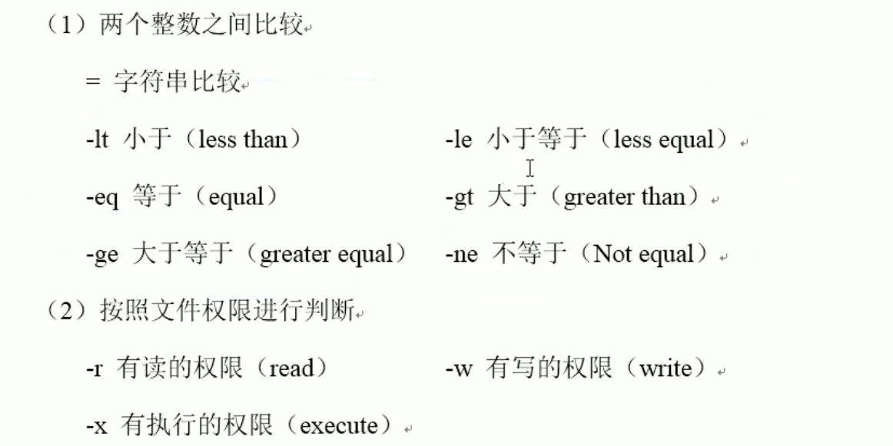
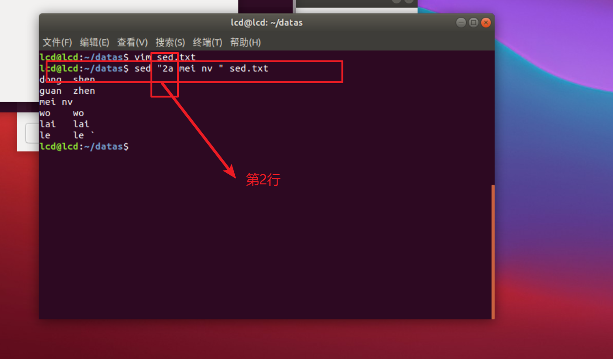

# 0.不懂地方


- shell  工具使用 cut 


# 1.Shell 概述

1. 需要看懂运维人员编写的shell 程序
2. 偶尔回编写一些简单的shell 程序来管理集群，提高开 发效率。

​    shell 是一个命令行解释器，它接收应用程序、用户命令，然后调用操作系统内核


shell还是一个功能强大的编程语言

# 2.Shell 解释器

linux 提高的Shell 解析器有


# 3.Shell 脚本入门

## 1. 脚本格式

脚本以 #!/bin/bash 开头（指定解析器）

## 2. 第一个Shell 脚本：helloworld 

1. 需求：创建一个shell 脚本，输出hello world 

2. 案例实操

   

   ```shell
   #!/bin/bash
   echo "hello world "
   ```

3  脚本的常用执行方式

第一种： 采用bash 或 sh   +  脚本的相对路径或者绝对路径（不用赋予脚本 +x权限）

​     sh + 脚本的相对路径

```linux
sh helloworld.sh 
```


第二种：采用输入脚本的绝对路径或者相对路径 执行脚本（必须具有可执行权限 +x）


## 3. 第二个shell 脚本： 多命令处理


问题： echo "I love cls " >> cls.txt   这句话能让 l love cls 调用到 cls.txt 文档中，重定向？

# 4.Shell 中的变量

## 1. 系统变量


代表着是一种系统目录

永久变量 是环境变量   其值不会随shell脚本的执行结束而消失

## 2. 自定义变量

### 1. 基本语法：

​	1 定义变量： 变量=值  

​    2 撤销变量： unset变量

   3  声明静态变量：readonly 变量，不能 unset 

### 2. 变量定义规则

1. 变量名称可以有字母，数字，和下划线组成，但是不能以数字开头，环境变量名建议大写。
2. 等号两侧不能有空格。
3. **在bash 中，变量默认类型都是字符串类型，无法直接进行数值运算。**
4. 变量的值如果有空格，需要使用双引号或单引号括起来。


### 3. 案例实操


## 3. 特殊变量： $n 

### 1. 基本语法

$n    功能描述：

  n为数字,  

  $ 0 代表该脚本名称，

$ 1-$9 代表第一到第九个参数

十个以上的参数，十以上的参数需要用大括号包含，如${10}

### 2.案例实操


## 4. 特殊变量： $#

### 1. 基本语法

$#  功能描述：  获取所有输入参数个数，常用于循环

### 2.案例实操

 1 获取输入参数的个数


## 5. 特殊变量： $ *, $ @

### 1. 基本语法

$* 功能描述：这个变量代表命令行中所有的参数，$* 把所有的参数看成一个整体

$@ 功能描述：这个变量也代表命令行中所有的参数，不过$@ 把每个参数区分对待

### 2. 案例实操




## 6. 特殊变量：$?

### 1. 基本语法

$?     功能描述：最后一次执行的命令的返回状态，如果这个变量的值为0，证明上一个命令正确执行，如果这个变量的值为非0 （具体是哪个书，有命令自己来决定）则证明上一个命令执行不正确了

### 2.案例实操


# 5.运算符

## 1. 基本语法

1. $((运算符) )     $[运算式]

2. expr  + ,-,\ *,  /,     %     加 减 乘 除 取余 

   注意expr 运算符间要有空格

## 2.操作实例


# 6.条件判断

## 1. 基本语法

[ condition ] (注意 condition 前后要用空格)

注意： 条件非空即为 true [ atguigu ] 返回true,[] 返回false

## 2. 常用判断条件




## 3.案例实操


# 7.流程控制

## 1.if 判断

1.  基本语法

if [ 条件判断式 ]； then

   程序

fi 

或者

if [ 条件判断式 ]

  then  

​     程序 

fi 

注 意事项：

1. [ 条件判断式 ] ，中括号和条件判断式之间必须有空格
2. if 后要有空格

### 2. 案例实操

1.  输入一个数字，如果是1，  


## 2 case 语句

### 1 基本语法

case $变量名 in

"值 1")

如果变量的值等于值1，则执行程序1

;;

"值2" )

如果变量的值等于值2 ，则执行程序2 

;;

*)

如果变量的值都不是以上的值，则执行此程序

;; 

esac 

#### 注意事项

1. case 行尾必须尾单词 "in" ,每个模式匹配必须以右括号  " ) "  结束
2. 双分号 ";;" 表示命令序列结束，相当于java中的break 
3. 最后的 " *) " 表示默认模式，相当于java 中的default 

### 2 案例实操

输入一个数字，如果是1，则输出banzhang 如果是2 则输出cls ,如果是其他输入renyao 


## 3 for 循环

### 1.基本语法1

  for((  初始值;循环控制条件;变量变化 ))

   do

   	  程序

   done

### 2.案例实操 

 从1 加到 100 


 

## 4. while 循环

### 1. 基本语法

  while [ 条件判断式 ]

  do 

​       程序  

 done   

### 2.案例实操

 


# 8. read 读取控制台输入

## 1. 基本语法

read (选线)(参数)

选项：

​       -p : 指定读取值时的提示符

​	   -t ：指定读取值时等待的时间（秒）

参数

​       变量：指定读取值的变量名

## 2. 案例实操

提示7秒内，读取控制台输入的名称


# 9.函数


## 1. 系统函数

### 1. bashename 基本语法

basename [string/pathname] [suffix]

功能描述：basename 命令会删掉所有的前缀包括最后一个（‘ /‘）字符，然后将字符串显示出来

选项：

suffix 为后缀，如果sufiix 被指定了，basename 会将pathname 或 string 中的suffix去掉 

#### 案例实操


目的：在一长串命令中，找到文件名称

### 2. dirname 基本语法

dirname 文件绝对路径， 

功能描述：从给定的包含绝对路径的文件中去除文件民（非目录的部分），然后返回剩下的路径，（目录的部分）

#### 案例实操

获取banzhang.txt文件的路径，


## 2. 自定义函数

### 1. 基本语法

[function ] funname[()]

{

​     Action;

​    [return int;]

}

### 2. 经验技巧

1. 必须在调用函数之前，必须先声明函数，shell脚本时逐行运行，不会像其他语言一样先编译
2. 函数返回值，只能通过$? 系统变量获得，可以显示加 return 返回，如果不加，将以最后一条命令运行结果，作为返回值，return 后跟数值，n(0-255)


### 3.案例实操

计算两个输入参数的和


# 10. Shell 工具（重点）


## 1. cut  

cut 的工作就是 “剪” ，具体的说就是发原则剪切数据用的，cut命令从文件的每一行剪切字节，字符和字段，并将这些字节，字符，和字段输出

### 1. 基本用法

 cut [选项参数] filename

 说明:默认分隔符时制表符

### 2. 选项参数说明


  

### 3. 实例实操

1. 切割第一列 

 源文件


2. 切割第 2， 3 列


4.  选取系统PATH 变量值，第二个 “：” 开始后的所有路径


 


## 2. sed

 sed 是一种流编辑器，它一次处理一行内容，处理时，把当前的处理的行存储在临时缓冲区中，称为“模式空间”，接着用sed命令处理缓冲区的内容，处理完成后，把缓冲区的内容送往屏幕，接着处理下一行，这样不断重复，直到文件末尾，**文件的内容并没有改变**，除非你使用重定向储存输出

### 1. 基本用法

​    sed[选项参数 ]  “command ”  filename

### 2. 选项参数说明

  -e    直接在指令列模式上进行sed 的动作编辑   

单个命令不用 加 -e

多个命令一起执行时，需要加上-e


### 3. 命令功能描述

| 命令 | 功能描述                                |
| :--: | --------------------------------------- |
|  a   | 新增，a的后面可以接字符串，在下一行出现 |
|  d   | 删除                                    |
|  s   | 查找并替换                              |


### 4.实例实操

1. 





## 3.awk 

一个强大的文本分析工具，把文本逐行的读入，以空格为默认分隔符将每行切片，切开的部分再进行分析处理


### 1. 基本用法

awk [**选项参数**] ’pattern1{action1} pattern2{action2} .....‘    filename

pattern: 表示AWK在数据中查找的内容，就是匹配模式

action :  在找到匹配内容时所执行的一系列命令

**正则表达式**

### 2.选项参数说明

| 选项参数 | 功能                 |
| :------: | -------------------- |
|    -F    | 指定输入文件折分隔符 |
|    -v    | 赋值一个用户定义变量 |

### 3.实例操作


### 4. awk的内置变量


### 5. 案例实操


## 4. sort 

sort 命令是在linux 里非常有用，它将文件进行排序，并将排序结果标准输出

### 1.基本语法 

sort (选项)(参数)

| 选项 |           说明           |
| :--: | :----------------------: |
|  -n  |    依照数值的大小排序    |
|  -r  |    以相反的顺序来排序    |
|  -t  | 设置排序时所用的分隔字符 |
|  -k  |     指定需要排序的列     |

参数： 指定待排序的文件列表


### 2. 案例实操


# 11. 企业面试题 

## 1.京东


## 2. 搜狐&和讯网


## 3. 新浪


## 4. 金和网络


